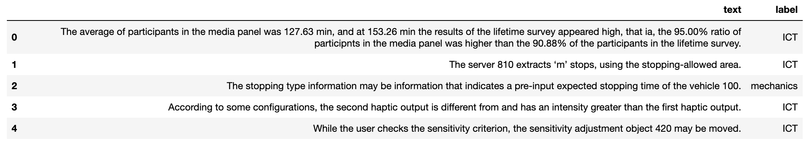
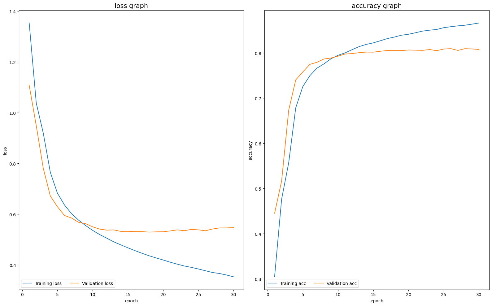

# Project Description
### Purpose of Project
RNN 계열 모델을 활용한 Text Classification Project.  
주어진 여러 문장을 특정 그룹(4개의 학과 명 중 하나)으로 categorizing하는 것이 목표.  
(This is second mini project from 2022-1 CSE4048 lecture.)

### Dataset
</p>
<p align="center">
	
	<figcaption align="center">[사진 1] train data의 text, label 예시</figcaption>
</p>

### File Description

**Skeleton Files**

- train.py  
Train and save the model you made.

- model.py  
Change model parameters and architecture.
- vocab.py  
Build the vocabulary of train data.
- util.py  
Add padding to the batches.
- dataset.py  
Load dataset and make data loader.
- test.py  
Use this file to test your saved models.
Write the same model parameters as in the train.py  

### How to start
```bash
# You can see argument description using -h
$ python test.py
```

# Result

</p>
<p align="center">
	
	<figcaption align="center">[사진 2] Learning graph of LSTM(1 layer)</figcaption>
</p>
Test acc is around 80%.  

More graphs would be updated soon.  

### Analysis


### Reference


### Update
2022.05-06 project develop  
2023.03 &nbsp;&nbsp;&nbsp;&nbsp;&nbsp;&nbsp;project update